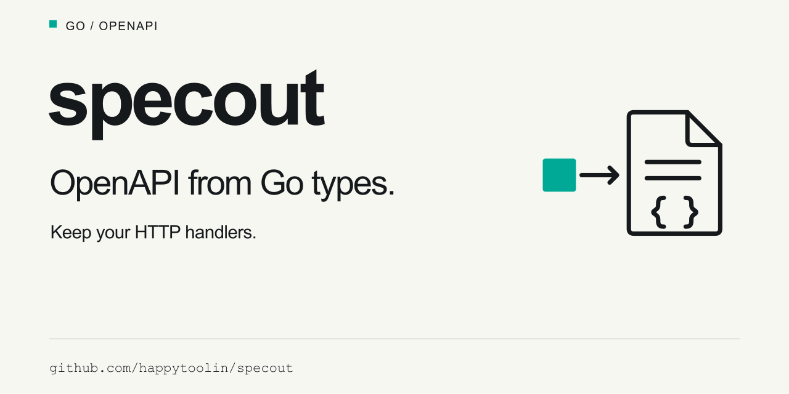

# specout

We built specout to add API docs without replacing your router or changing the
request lifecycle.



Generate OpenAPI from Go types. Keep your existing HTTP handlers.

specout supports `net/http`, chi, and gorilla/mux. You can keep your router and
middleware.

> **Experimental**
>
> specout is experimental. The public API may change.
> Feedback and reports from real services are welcome.

## How it works

Define request and response types. Add field tags to describe parameters and
bodies. Attach the types to your handler with `specout.Handler[Request, Response]`.

Your handler still gets `http.ResponseWriter` and `*http.Request`. It reads the
request. It validates input. It writes the response.

Tags describe the API contract. Your code must enforce it. specout does not
decode or validate requests. You do not need comment annotations or generated
handlers.

## Install

Use **Go 1.27 or later**.

```sh
go get github.com/happytoolin/specout@v0.0.1
```

## Example

This example serves a greeting and its OpenAPI document.
Only `Title` and `Version` are required in `Config`.

Save this as `main.go` in your Go module:

```go
package main

import (
	"encoding/json/v2"
	"log"
	"net/http"

	"github.com/happytoolin/specout"
)

type HelloRequest struct {
	Name string `path:"name"`
}

type Greeting struct {
	Message string `json:"message"`
}

func hello(w http.ResponseWriter, r *http.Request) {
	w.Header().Set("Content-Type", "application/json")
	if err := json.MarshalWrite(w, Greeting{Message: "Hello, " + r.PathValue("name")}); err != nil {
		log.Print(err)
	}
}

func main() {
	doc := specout.New(specout.Config{
		Title:       "Hello API",
		Version:     "1.0.0",
		Description: "A simple greeting service.",
		Contact: &specout.Contact{
			Name:  "API team",
			Email: "api@example.com",
		},
		Servers: []specout.Server{
			{URL: "http://localhost:8080", Description: "Local server"},
		},
		Tags: []specout.Tag{
			{Name: "greetings", Description: "Greeting operations"},
		},
	})
	mux := http.NewServeMux()

	specout.Std(doc, mux).Get("/hello/{name}", specout.Handler[HelloRequest, Greeting]{
		HandlerFunc: hello,
		Summary:     "Say hello",
		OperationID: "sayHello",
		Tags:        []string{"greetings"},
	})
	mux.Handle("GET /openapi.json", doc)

	log.Fatal(http.ListenAndServe("localhost:8080", mux))
}
```

Run `go run .`.

Open [localhost:8080/hello/Ada](http://localhost:8080/hello/Ada) to get a greeting:

```json
{"message":"Hello, Ada"}
```

Open [localhost:8080/openapi.json](http://localhost:8080/openapi.json) to get the API document.

`HelloRequest` describes the path parameter. `Greeting` describes the JSON
response. The `hello` function handles the request.

`Config.Tags` describes each group of routes. `Handler.Tags` puts a route in a
group. `OperationID` sets a stable name for client code.

`Servers` sets the base URLs in the API document. It does not set the address of
the HTTP server or change route paths.

### More configuration options

Add these fields to `specout.Config` when your API needs them:

| Field | Purpose |
|---|---|
| `TermsOfService` | Add a link to the terms of service. |
| `License` | Add the API license name and URL. |
| `ExternalDocs` | Add a link to an API guide. |
| `Auth` | Describe authentication. Your middleware must check credentials. |
| `ErrorType` and `DefaultErrors` | Describe a shared error body and its status codes. Your handlers write the error responses. |
| `ClosedSchemas` | Declare that object schemas do not allow unknown fields. Your code must enforce this rule. |

See [configuration and authentication](skills/specout/references/configuration.md)
for code examples.

## Use your router

Use `specout.Std` with `http.ServeMux`. Use `specout.Chi` with chi. Use
`specout.Gorilla` with gorilla/mux.

With chi, call `Adopt` on the outermost router after you register the routes.
This resolves paths from route groups and mounted routers.

With other routers, register the routes separately. Use `specout.Document` to
record their API contracts.

### Future router support

We are interested in adding adapters for Echo, Fiber, and other routers.
Community demand will guide this work.

Request router support in the [issue tracker](https://github.com/happytoolin/specout/issues).

## Serve or export the document

The output uses OpenAPI 3.1 and JSON Schema 2020-12. The JSON output has a stable
order.

Register all routes before you call `ServeHTTP` or `WriteJSON`. After a successful
document build, you cannot add routes.

## Check the API docs

With chi and gorilla/mux, tests can find routes that have no documentation.

`http.ServeMux` cannot list its routes. Use `specout.Std` to register each route
that needs documentation.

The optional `recorder` package can compare response statuses from HTTP tests
with the declared statuses. It does not check response bodies.

## More information

- [Runnable examples](examples/README.md).
- [Sample API document](examples/onboarding/openapi.json).
- [Request types and responses](skills/specout/references/types-and-responses.md).
- [Router setup and documentation checks](skills/specout/references/routers-and-verification.md).
- [Configuration and authentication](skills/specout/references/configuration.md).

Feedback and contributions are welcome. More router adapters are also welcome.

## Development

Read the [code guide](CONTRIBUTING.md) for build steps and the file layout.

```sh
just check  # All CI and release checks.
just lint   # Go lint rules and formatting.
just demo   # Run the onboarding example.
```

`just check` requires Go, Python 3, and Node.js with npm. It checks builds,
formatting, and lint rules. It runs tests, race checks, and vulnerability scans.
It validates API documents. It generates and compiles client types. It also
checks module files and GitHub Actions workflows.

Coding agents can use the optional [specout skill](skills/specout/SKILL.md).

Install it with this command:

```sh
npx skills add happytoolin/specout --skill specout
```

## License

[Apache 2.0](LICENSE).
