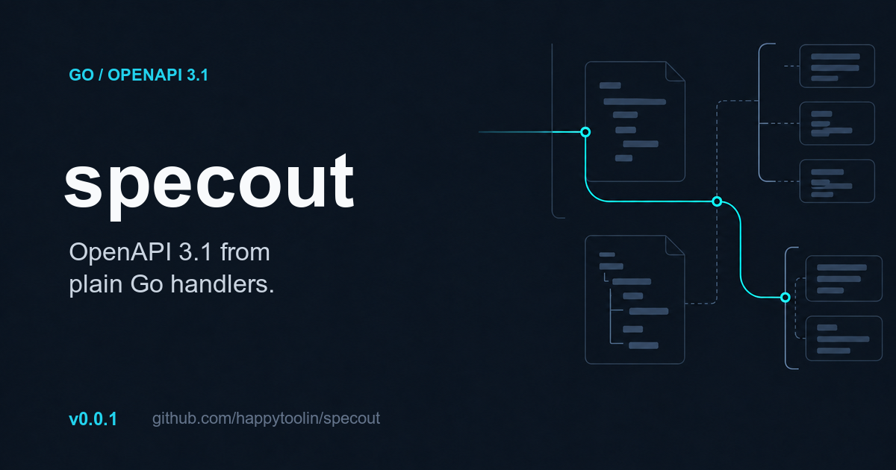

# specout v0.0.1 launch kit



## Core message

**One line:** Generate deterministic OpenAPI 3.1 from plain Go HTTP handlers.

**What makes it useful:** Keep `net/http`, `chi/v5`, or `gorilla/mux`. Describe the contract with Go types and tags. Test documented routes and response statuses against runtime behavior. More router adapters and contract cases are welcome.

**Primary link:** https://github.com/happytoolin/specout

**Release:** https://github.com/happytoolin/specout/releases/tag/v0.0.1

## Where to post

Post in this order. Adapt the opening line for each community. Do not publish every post at the same time.

1. **[r/golang](https://www.reddit.com/r/golang/)** — Use the [Reddit announcement](REDDIT.md). Check the current posting rules. Use the weekly Small Projects thread if required.
2. **[Go Forum](https://forum.golangbridge.org/), Technical Discussion** — The forum accepts announcements about Go packages and projects. Ask for specific technical feedback.
3. **[Bluesky](https://bsky.app/) or [X](https://x.com/)** — Use the short post with the OG image. Reply with one code example if people engage.
4. **[LinkedIn](https://www.linkedin.com/)** — Use the longer post if your network includes backend or platform engineers.
5. **[Hacker News, Show HN](https://news.ycombinator.com/showhn.html)** — Use the repository as the submission URL. Post only when you can answer questions for the next few hours.
6. **[Go Weekly](https://golangweekly.com/)** — Submit the repository and the short newsletter pitch below.
7. **[Lobsters](https://lobste.rs/about)** — Use only if you already participate there. Its guidance limits self-promotion to less than one quarter of your activity.

After the initial launch, write one technical article about preventing OpenAPI drift. Submit the article separately instead of reposting the release announcement.

## Short social post

Released specout v0.0.1: deterministic OpenAPI 3.1 from plain Go HTTP handlers. Supports net/http, chi, and gorilla/mux; tests catch route and status drift. Router requests and contributors are welcome.

https://github.com/happytoolin/specout

#golang #opensource

## Reddit

Use the standalone [Reddit announcement](REDDIT.md). If moderators redirect it, use the same body in the weekly Small Projects thread.

## Go Forum

**Title:** specout: OpenAPI 3.1 from plain Go HTTP handlers

I released specout v0.0.1. It generates deterministic OpenAPI 3.1 documents while normal Go handlers keep control of decoding, validation, and responses.

It supports `net/http`, `chi/v5`, and `gorilla/mux`. Contracts use Go types and field tags. The test helpers can compare documentation with live routes and observed response statuses.

```bash
go get github.com/happytoolin/specout@v0.0.1
```

Repository: https://github.com/happytoolin/specout

I would value feedback on the registration API, generated schemas, HTTP cases, and router adapters that should be covered before v0.1.0. Contributions are welcome.

## Hacker News

**Title:** Show HN: specout – OpenAPI 3.1 from plain Go HTTP handlers

**Submission URL:** https://github.com/happytoolin/specout

**First comment:**

I built specout because I wanted OpenAPI documentation without replacing normal Go handlers or maintaining a second routing model.

Routes are registered through small adapters for `net/http`, `chi/v5`, and `gorilla/mux`. Request and response schemas come from Go types. The output is deterministic, so it works well as a reviewed artifact. Tests can also compare documented routes and statuses with runtime behavior.

This is v0.0.1 and the API is still pre-1.0. I am looking for feedback on API ergonomics, schema edge cases, missing router adapters, and the tradeoff between explicit metadata and inference. Contributions are welcome.

## LinkedIn

I released specout v0.0.1, an open-source Go library for generating deterministic OpenAPI 3.1 documents from plain HTTP handlers.

The design goal is simple: keep application code native. Your handlers still control request decoding, validation, and responses. specout records the contract through Go types, field tags, and thin adapters for `net/http`, `chi/v5`, and `gorilla/mux`.

It also adds tests for a common failure mode: documentation drift. You can compare documented routes with the live router and declared response statuses with statuses observed during tests.

The project is early and public. Feedback on the API, missing HTTP edge cases, and routers that need adapters is welcome. Contributions are open.

https://github.com/happytoolin/specout

#golang #openapi #opensource #backend

## Go Weekly

**Title:** specout: OpenAPI 3.1 from plain Go HTTP handlers

**Pitch:** specout is a new Go library that generates deterministic OpenAPI 3.1 documents from normal `net/http`, `chi/v5`, and `gorilla/mux` handlers. It uses Go types and tags for contracts and can test documentation against live routes and observed response statuses.

**Link:** https://github.com/happytoolin/specout

## Lobsters

**Title:** specout: OpenAPI 3.1 from plain Go HTTP handlers

**Suggested tags:** `go`, `web`, `release`

Use the Hacker News first comment as the discussion starter. Remove the launch language and lead with the design tradeoff.

## Launch checklist

- Upload `specout-v0.0.1-og.png` as the GitHub repository social preview.
- Use the same image for Bluesky, X, LinkedIn, and forum posts that support images.
- Link to the repository, not several destinations, in the first post.
- Stay available for replies after each community post.
- Do not ask for votes or coordinated engagement.
- Add the pkg.go.dev link after its page becomes available.
